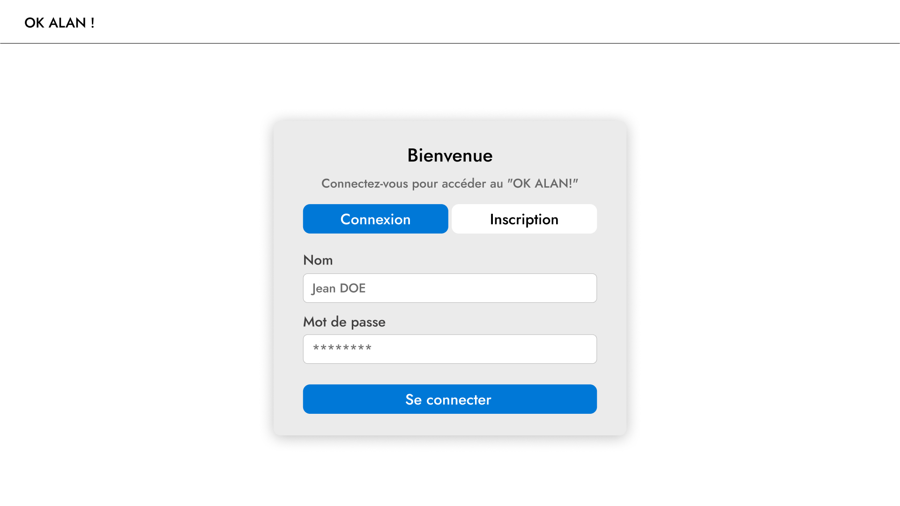
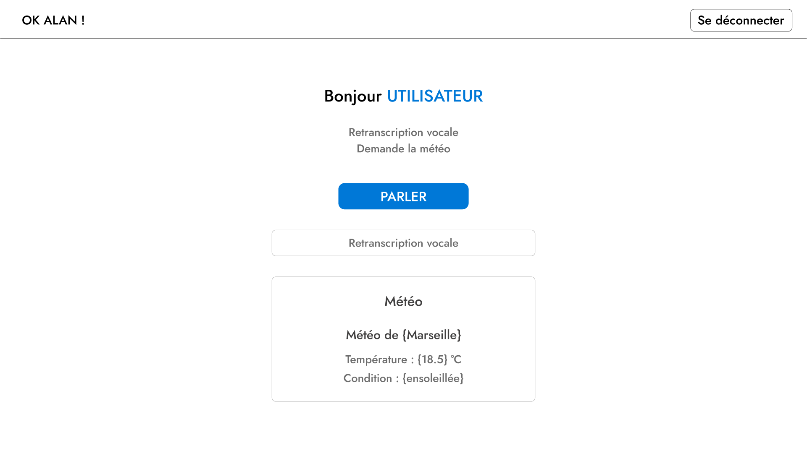

# OkAlan
 
Équipe de développement : Clément VITRAT-GUTIERREZ, David MORAIS PEREIRA, Angie PONS
 
## Présentation de l'interface
 
Notre projet propose une interface utilisateur permettant de :
 
* Interagir avec l'application à l'aide de commandes vocales
  * Retranscription Vocale : Convertit la voix en texte affiché ([https://www.blagues-api.fr/](https://www.blagues-api.fr/ "https://www.blagues-api.fr/"))
  * Météo : Lis la météo à voix haute (openweather)
  * Blagues : Lis une blague à voix haute
* Gérer les utilisateurs avec un système d'authentification
* Fournir une expérience fluide grâce à l'utilisation de React (Frontend) et Express.js (Backend)
 
## Choix des technologies
 
### JavaScript / React
 
* **React** : utilisé pour le frontend
  * Permet de créer des interfaces dynamiques et réactives
* **JavaScript** : utilisé pour la logique applicative et les interactions utilisateur
 
### Express.js
 
* Framework pour le backend
* Utilisé pour gérer les routes et les API
 
### MySQL
 
* Base de données relationnelle
 
## Organisation des fichiers
 
### BACKEND
 
* Dossier **"Backend"**
  * Contient le code pour la partie serveur
  * Fichiers principaux :
    * *auth/* : Gère les fonctions d'authentification
    * *db/* : Gère la gestion de la base de données MySQL
    * *meteo/* : Gère les services liés aux données météorologiques
 
### FRONTEND
 
* Dossier **"Front"**
  * Contient le code pour l'interface utilisateur
* Structure du Frontend :
  * *public/* : Contient des fichiers publics
  * *src/* : Contient le code source
    * *components/* : Regroupe les composants React
      * *Header.jsx* : Barre de navigation
      * *HomeContent.jsx* : Page d'accueil
      * *LoginForm.jsx* : Formulaire de connexion
      * *VoiceControlledJoke.jsx* : Gestion de la blague
      * *VoiceControlledWeather.jsx* : Gestion de la météo par commande vocale
      * *VoiceRecognition.jsx* : Gestion de la reconnaissance vocale
    * *pages/*
      * *HomePage.jsx* : Page principal
    * *styles/* : Contient les fichiers CSS
 
## Nos fonctionnalités
 
### RETRANSCRIPTION VOCALE
 
* **Utilisation API native : SpeechRecognition**
 
  * Ce composant permet d'activer ou désactiver l'écoute avec un bouton.
* **Transcription** : Convertit la voix en texte affiché.
* **Langue** : Fonctionne en français grâce à l'API SpeechRecognition.
* **Interface** : Affiche un bouton et la transcription du discours détecté.
 
### METEO
 
* Utilisation API native : SpeechRecognition**
 
  * Ce composant permet d'activer ou désactiver l'écoute avec un bouton.
  * Si le mot "météo" est détecté, il déclenche la récupération des informations météorologiques
* **Récupération de la météo** :
 
  * La fonction "postGeoloc" récupère les données de la localisation.
* **Synthèse vocale** : Lis la météo à voix haute avec "speak".
* **Interface** : Affiche un bouton et les données de météo.
* **Fonctionnalité** : Commande vocale pour obtenir la météo plus facilement.
 
### BLAGUES
 
* **Blague vocale** : Le composant affiche et lit une blague à voix haute grâce à la fonction "speak".
* **Récupération de la blague** : La blague est obtenue via la fonction "fetchJoke".
* **Délai pour la réponse** : La blague est lue 5 secondes.
* **Affichage** : La blague et sa réponse sont affichées dans l'interface utilisateur.
 
## Nos maquettes
 
### Maquette page "Accueil"
 
- Une page simple avec un formulaire de "Connexion"
- Une barre de navigation avec le nom de notre interphone vocal
 

 
### Maquette page "Utilisateur"
 
* Une fois l'utilisateur connecté
* Message de bienvenue avec son nom
* Ajout d'un bouton "Se déconnecter" dans la barre de navigation
* Un bouton "Parler" pour exécuter les demandes
 
